# Audit e semplificazione JobWatch — 3 ottobre 2026

## Stato reale di partenza

Audit avviato sul vero `main`, SHA **432c2e175705c9475cc63a79bb80f5335e4040d4**. Nessuna modifica al codice prima di ricostruire pipeline, workflow, configurazioni, manifest, audit, health, decisioni e struttura dei file grandi. Inventari/cache/registri grandi sono stati aggregati da Python; letture mirate solo per verificare fingerprint, invalidazioni, ION e record problematici.

Repository **pubblico**, `main.protected=false`, permesso amministrativo disponibile. Visibility e protezioni non sono state cambiate. Stato iniziale: 582 commit, di cui 168 di `github-actions[bot]`; 104 commit con oggetto “Sync Job Watch semantic state”, 46 “Update Job Watch vacancy snapshots”. 12 branch remoti compreso main: solo `ats-successfactors-v15b` risulta antenato di main, gli altri 10 richiedono verifica dei diff/squash prima di considerarli obsoleti. Nessun branch cancellato.

Quattro workflow, 504 righe YAML, tutti writer con la **stessa concurrency group già presente**. Il locking e il reset/rigenerazione su main avanzato erano già implementati: non erano problemi da reinventare. Schedule già espresso in Europe/Rome: 06:30, recovery 07:15, recovery 08:00. Il guard normalmente saltava un giorno già fresco, ma alle 08:00 poteva ancora avviare una raccolta concorrente alla Daily.

194 aziende iniziali; 2.674 vacancy aperte nello stato analitico; 794 pending; audit: 160 pending daily e 634 storico. 24.231.133 byte JSON complessivi, inclusi 9.774.157 byte analysis results, 977.694 byte queue e 1.312.078 byte cache. Gli inventari correnti occupavano 2.317.983 byte. Quattro registri semantici e quattro surfaced registries; 86 decisioni utente (40 NOT_INTERESTED, 31 TO_REVIEW, 10 INTERESTED, 5 APPLIED).

ION Group **non era rimossa**: presente in universo, batch, mapping, snapshot e coda. I vecchi `vacancies.json` e `coverage.json` erano contenitori vuoti inutilizzati. `coverage_report.py` è invece un comando manuale utile per manutenzione ATS e rimane disponibile. Il collector contiene varie ridefinizioni concatenate degli adapter: molte sono wrapper effettivamente chiamati, non dead code; non sono state cancellate indiscriminatamente.

## AS-IS e source of truth

```mermaid
flowchart LR
  A[Source / ATS] --> B[Collector + adapter]
  B --> C[Normalize + ID / URL]
  C --> D[Lifecycle e fingerprint]
  D --> E[Sync: filtri deterministici]
  E --> F[Semantic queue completa]
  F --> G[JD enrichment manuale / separato]
  G --> H[ChatGPT semantic decision]
  H --> I[User decision + surfaced history]
  I --> J[Persistence Git]
  J --> K[Sync + harden + audit + certification]
  K --> L[Daily report]
```

| Area | Autorità | Derivato / ruolo effettivo |
|---|---|---|
| Regole | `job_watch_rules.json` | Politiche permanenti, seniority, salary, priorità, L.68/99 |
| Aziende | universo base + `watchlist_additions.json`, assegnati in batches | ATS mapping configura l'accesso reale; collector itera il mapping |
| Fonte | ATS ufficiale | `current_jobs_jw*.json` conserva lifecycle e metadata; Amazon ha snapshot ufficiale dedicato con JD |
| Semantica | `semantic_decisions_jw*.json`, esatto fingerprint | `analysis_results_jw*.json` unisce fonte, semantica, scelte e reporting |
| Scelte utente | `user_job_decisions.json` | Persistono indipendentemente da lifecycle/semantic; NOT_INTERESTED può riaprirsi su cambio materiale |
| Reporting | `surfaced_jobs_jw*.json` | Solo quanto effettivamente comunicato, non una nuova decisione di fit |
| Coda | nessuna nuova autorità | `semantic_queue_jw*.json` deriva dal pending; prima mescolava storico e daily |
| JD | testo ufficiale associato al fingerprint | `semantic_jd_cache_jw*.json` è cache, non decisione |
| Esecuzione | `job_watch_run_state.json` | Manifest delle attività realmente completate su snapshot preciso |
| Certificazione | audit dei dati + manifest | Health finale prodotto da `certify_job_watch.py`, mai dai soli flag dichiarati |
| Discovery | ricerche ChatGPT + fonti ufficiali | `discovery_candidates.json`: sei aziende staged, ultimo aggiornamento 20 settembre; nessun collector/promotion automatico |

L'enrichment non era collegato alla raccolta daily. Queue e cache avevano selezioni daily diverse dall'audit. `sync_analysis_state.decision_valid` e il successivo hardening avevano contratti diversi: 59 decisioni ammesse dal sync venivano riaperte dal hardening. I summary restavano in parte incoerenti dopo quella seconda scrittura. Ogni batch collector scriveva lo stesso snapshot **cinque volte** attraverso wrapper concatenati; audit e certification scrivevano due healthcheck diversi in sequenza.

## Root cause dei PARTIAL e failure osservati

Gli ultimi 12 Actions letti al momento dell'audit: **8 success, 4 failure**. Tutti i quattro failure sono stati verificati nelle step/log:

- [37116337399](https://github.com/giacodmr/job-watch-milano/actions/runs/37116337399): reconciliation Euronext R27644 abortiva per HTTP 403 sul dettaglio Workday.
- [37116929639](https://github.com/giacodmr/job-watch-milano/actions/runs/37116929639): reconciliation abortiva perché il titolo R27644 era assente dalla corporate listing.
- [37117873605](https://github.com/giacodmr/job-watch-milano/actions/runs/37117873605): test della side-path Euronext falliva su canonical ID `R25984` vs slug esteso.
- [37118467001](https://github.com/giacodmr/job-watch-milano/actions/runs/37118467001): compile falliva con `No such file or directory: reconcile_external_lifecycle.py`.
- [37118550818](https://github.com/giacodmr/job-watch-milano/actions/runs/37118550818): successivo collector riuscito dopo rimozione della side-path e dei riferimenti rotti.

Quindi il riferimento mancante e quei crash **erano già corretti sul main iniziale**. Il problema ancora presente era la decisione attiva Euronext non riconciliata, non il file mancante. È mantenuta e ora esposta esplicitamente nel worklist, senza inventare OPEN/CLOSED o cancellare la scelta utente.

La raccolta riusciva ma `DAILY_COMPLETE=false` era legittimo: manifest appena inizializzato `PENDING`, semantic/autonomous/priority flag false, 160 pending daily, reporting non riconciliato e R27644 assente. Gli ATS PARTIAL non sono da soli un blocco daily: erano già separati da FAILED/NOT_CHECKED. Nel nuovo live E2E ci sono 108 PARTIAL, molti portali dinamici raggiungibili ma senza enumerazione esaustiva sicura, e zero FAILED/NOT_CHECKED. Non sono stati promossi con un semplice cambio di label.

La root cause di workload è la selezione: cutoff permanente `never_disappear_since` trascinava vacancy ormai storiche nel daily; ChatGPT doveva orientarsi tra 794 pending e grandi registri; JD non preparate automaticamente; doppia validazione generava lavoro oscillante. Un delta NEW non concluso poteva perdere la propria identità al passaggio a STILL_OPEN. Anche un vecchio `surfaced_at` poteva far sembrare riportato un fingerprint nuovo: corretto ora con riconciliazione della superficie sul fingerprint.

## Priorità

| Priorità | Problema | Esito |
|---|---|---|
| P0 | Decisione TO_REVIEW Euronext R27644 non riconciliata | Preservata, visibile nel worklist e bloccante nella certificazione; fonte non conclusiva |
| P0 | Rischio di certificare un fingerprint aggiornato usando un report vecchio | Reporting del delta/APPLIED update richiede fingerprint attuale |
| P0 | Workflow riferito a script rimosso | Già corretto; aggiunti preflight su workflow **e entrypoint**, CI su PR e test di regressione |
| P1 | Backlog storico trascinato nel daily | Ledger del delta futuro persistente, storico separato, tranche stabile di 20 |
| P1 | Due validazioni/schema divergenti e seconda riscrittura | Un solo validatore applicato nel sync; eliminato lo stage hardening |
| P1 | JD mancanti e navigazione manuale | Enrichment integrato dopo sync, cache esatta, testo Amazon raccolto riusato |
| P1 | ION ancora attiva | Rimossa da tutte le configurazioni e dallo snapshot operativo; storico preservato escluso dai report |
| P1 | Storia utente/semantica enorme da ricostruire per scrivere | Patch piccolo snapshot-bound, merge dei soli record cambiati nel sync |
| P1 | Recovery collector alle 08:00 | Eliminata; 06:30 + 07:15 se necessaria, controlli di freschezza su fallimenti |
| P2 | Repeated sync produceva commit per timestamp | Output byte-identici se input invariato |
| P2 | Cinque scritture snapshot per batch, due health writers | Una scrittura collector, un solo writer del health finale |
| P2 | ATS mapping/maint e discovery troppo pesanti nella Daily | Policy weekly separata, daily discovery leggera con evidenze reali |
| P2 | Stato personale in repo pubblico / branch accumulati | Segnalato; nessuna modifica automatica a privacy/protection/branch |

## TO-BE e modifiche concrete

GitHub raccoglie → normalizza/lifecycle → sync unico applica filtri e decisioni valide → prepara JD solo per lavoro selezionato → genera `daily_worklist.json` → ChatGPT ragiona solo sulle righe `needs_semantic_review` → scrive un unico `daily_updates.json` → GitHub valida snapshot e record, unisce registri e manifest → audit/certification → verifica del health persistito → report.

`job_watch.py` espone quattro stage espliciti (collect, sync, enrich, amazon); nessun framework, database, servizio o infrastruttura nuova. Tutti i writer usano lo stesso percorso e la stessa strategia di pubblicazione: se main avanza, reset sul latest e rigenerazione, niente rebase di JSON generati. La pubblicazione distruttiva locale è disabilitata: `--publish` è ammesso solo in Actions su main e da checkout pulito.

`daily_worklist` riporta soltanto: pending delta, pending priority, TO_REVIEW/INTERESTED, ruoli validi da riportare senza rianalisi, APPLIED update, tranche storico, lifecycle e decisioni attive irrisolte. Contiene snapshot/hash regole, metadati necessari, fingerprint, JD cachata pertinente oppure errore di retrieval e riferimenti minimi. La selezione daily è la stessa usata dall'audit. Le tranche non si allargano al completamento di un ruolo dentro lo stesso snapshot.

La migrazione non finge che il backlog sia stato analizzato: i pending preesistenti non assegnati diventano storico. Tutti i nuovi delta o cambi materiali osservati dal nuovo sync restano mandatory fino a decisione/report, anche se il collector successivo li chiama STILL_OPEN. Pending priority ed espliciti TO_REVIEW/INTERESTED restano mandatory. Le opportunità già valide mai riportate restano presenti: il primo report potrà essere più lungo; quelle 147 righe non richiedono una nuova JD.

Triage breve: sette campi, soltanto REJECT chiaramente fuori funzione/geografia/pure sales/technical. Non accetta seniority, priority o protected ambiguity come scorciatoia. Il full review mantiene il contratto precedente. Manager/Senior/Lead restano eligibili dopo verifica JD; 0–5 mandatory vs preferred, floor €33k e L.68/99 restano inalterati. La salary hard rule richiede cap documentato `fixed_base_max_eur`, fonte e flag di evidenza; un minimo, una stima o salario assente non scartano.

Enrichment esegue soltanto worklist pending (inclusa tranche), riusa cache OK sul fingerprint e impone cooldown di sei ore agli errori sullo stesso fingerprint. Amazon usa description/basic/preferred già raccolte. Fallback HTML preferisce JobPosting JSON-LD; se deve leggere HTML, controlla matching title e pagine bloccate/chiuse. Non interpreta retrieval failure come rifiuto del ruolo.

`rejection_reason` ha nove categorie. Inferenza da motivo chiaro, richiesta del motivo per rifiuto vago; non alimenta i filtri. Backfill conservativo: 12 dei 40 rifiuti storici hanno categoria verificabile (6 WRONG_FUNCTION, 4 TOO_SENIOR, 2 SALARY_TOO_LOW); gli altri restano null. Motivi, fingerprint, status e date originali sono identici. Nuovi rifiuti senza motivo sono respinti dai validatori.

Eliminati: enrichment workflow separato (ora dispatch `stage=enrich` nel collector), tre duplicazioni della pubblicazione, intero stage hardening e seconda proiezione queue, secondo health writer, quattro scritture snapshot intermedie per batch, cutoff daily permanente, due placeholder legacy vuoti. Aggiunta una CI read-only: restano quattro workflow complessivi, **tre writer anziché quattro**. Nessun rewrite degli adapter.

## Test e risultato end-to-end

- **30 test passano**: M&A-title, salary cap/floor, 5 mandatory/7 preferred, seniority, priority full JD, stati L.68/99, fingerprint, decision reuse, rollover, NOT_INTERESTED riapribile, TO_REVIEW/INTERESTED/APPLIED, lifecycle UNKNOWN conservato, notice CLOSED non ripetuta, geografia e Luxembourg priority, Workday paginato/canonical ID, incomplete pagination, patch stale/merge storia, workflow script mancante, batch/JSON invalidi e certificazione persistita.
- Fixture E2E usa il comando reale `job_watch.py sync`: ottiene health COMPLETE, poi revoca/respinge COMPLETE con decisione stale; anche un vecchio surfaced fingerprint non certifica una vacancy aggiornata, mentre reporting del nuovo fingerprint ristabilisce COMPLETE.
- Live E2E `job_watch.py collect` eseguito il 3 ottobre: tutte le **193 aziende** tentate; VERIFIED 85, PARTIAL 108, FAILED 0, NOT_CHECKED 0. Reconciliation Workday recupera due path-target roles, Amazon quattro città VERIFIED con count reconciliation. Snapshot finale run_id `20261003T120112Z` (14:01:12 Europe/Rome).
- Primo enrichment recupera **68 JD, zero errori**; nel live collector successivo le riusa tutte senza nuovi fetch. 48 mandatory daily + 20 storico hanno JD disponibile nel worklist.
- Worklist finale: **232 righe**, 48 pending mandatory, 20 backlog assegnate, 736 pending storiche complessive (incluse le 20), 784 pending totali. Le altre righe riusano decisioni; 19 lifecycle notices e R27644 irrisolta sono fuori dall'elenco semantico.
- Verificati i JSON realmente scritti, non soltanto gli stdout. Tutti gli otto registri semantic/surfaced sono **identici** agli originali; tutte le 86 scelte utente mantengono i campi originali. ION assente da configurazioni, snapshot operativo e worklist; i suoi record storici restano archiviati.
- Secondo sync sugli stessi input: **ogni output derivato byte-identico** (analysis, queue, worklist, audit, health). `git diff --check` passa.

Il live health resta correttamente **DAILY_COMPLETE=false**: questa implementazione non ha svolto la review semantica, discovery e report della Daily. Restano 48 review mandatory, reporting da riconciliare, evidenze/flag del manifest e R27644. Non è stato forzato COMPLETE per far passare la prova.

## Before / after e limiti

| Misura | Prima | Dopo |
|---|---:|---:|
| Input JSON complessivo nel repo, proxy del rischio di letture indiscriminate | 24,23 MB | Worklist principale **0,775 MB** + regole/health piccoli |
| Pending nella coda completa | 794 | 784, storia conservata |
| Pending mandatory daily, stessi ruoli sostanziali | 160 (cutoff legacy) | 48 |
| Semantica selezionata oggi, compreso recupero storico | Coda completa 794 da navigare | 68 |
| Workflow writer | 4 | 3 |
| Righe YAML | 504 | 273, inclusa nuova CI |
| Validatori semantici | 2 divergenti | 1 |
| Scritture collector per batch | 5 | 1 |
| Scrittori health per sync | 2 | 1 |
| Ripetizione sync senza cambiamenti | Timestamp churn | Tutti i derivati invariati |
| Codice produzione + workflow, esclusi test/docs | 7.715 righe | 7.740 righe |

Il worklist è circa il 3,2% del totale JSON iniziale; **non è una misura di token effettivi** e non significa che ogni vecchio run leggesse tutti quei byte. Il carico semantic mandatory si riduce del 70% soprattutto separando lo storico: non si dichiara risolto il backlog. Il JSON totale su disco cresce moderatamente per JD pronte e proiezione, circa 25,4 MB, invece di cancellare la storia. L'ottimizzazione riguarda letture ChatGPT, passaggi, network e churn; non promette un repository più piccolo.

Backlog: tranche di 20 dopo il delta, completamento controllato in manutenzione. A 20/day senza nuovi ingressi, lo storico attuale richiede circa 37 tranche; è una stima di capacità, non una promessa di autonomia. Ruoli plausibili non vengono scartati per abbassare contatori.

Gli adapter conservano wrapper legacy e i fingerprint standard rimangono metadata-based: una JD modificata senza un segnale ATS/metadata non è rilevabile dal fingerprint. Amazon include qualifiche. Non è stata aggiunta una scansione quotidiana di tutte le JD, contraria alla richiesta di delta-first. La discovery resta lavoro ChatGPT su fonti reali; promozione/pruning settimanali sono una procedura, non un'automazione installata. Nessun scheduler ChatGPT esistente era disponibile da leggere/modificare in questa sessione; l'orario 08:00 resta assetto da configurare/verificare nel client.

## Privacy, issue rimaste e decisioni utente

La soluzione più semplice per le scelte personali già pubbliche è rendere privato questo repository, se non occorre distribuirne i dati. Alternative: separare soltanto lo stato personale, ma aumenta infrastruttura/complessità e non è stato implementato. Una visibility futura non rimuove copie pubbliche già create. Nessuna nuova protezione enterprise: CI su PR e writer serializzati sono proporzionati al progetto personale.

Da decidere realmente: visibility del repo; applicazione del prompt corto al task ChatGPT delle 08:00, perché quel task non è accessibile qui. R27644 richiede prova ufficiale conclusiva per OPEN/CLOSED, eventualmente link/evidenza aggiornata: non richiede di eliminare il TO_REVIEW per comodità. Branch cleanup può attendere una verifica dei diff. Nessuna richiesta di approvazione ha bloccato le modifiche reversibili o i test.

## Nuovo prompt Daily

Il testo pronto è in `DAILY_PROMPT.txt`; esecuzione in `DAILY.md`, manutenzione in `MAINTENANCE.md`. Il vecchio prompt del task ChatGPT non è disponibile, quindi non si inventa un rapporto di lunghezza before/after.

> Esegui la JobWatch Daily di giacodmr/job-watch-milano seguendo DAILY.md e le regole persistite. Verifica lo snapshot, processa il daily_worklist dando priorità al delta, riusa le decisioni valide e le JD cachate, fai discovery leggera, persisti un unico patch, verifica sync/certificazione e riporta solo opportunità, aggiornamenti rilevanti e health sintetico.
